# Jurasic Tic-Tac-Toe
mgh-geekshub-fsd-tictactoe-02022023

## Historia
Durante siglos los dinosaurion han librado una guerra, en la cual destacan dos bandos (Carnívoros y Herbívoros), para saber quien será el ganador de esta dura batalla tendrán que utilizar el ingenio y la estrategia.

## Stack

## Cómo funciona?
1. Una vez introducido en el juego podrás iniciarlo y comenzar a jugar o ir al apartado de reglas marcada con un pequeño bronto con un interrogante en la parte inferior izquierda de la pantalla.

2. Dentro de la selección de personajes podrás elegir uno de los bandos y deberás introducir tu nombre y darle a listo para que se active el boton de start y comenzar a jugar.

3. Los turnos seran un total de 3 por jugador una vez acabados podréis mover una de vuestras fichas para intentar ganar.

## Vistas en Ordenador
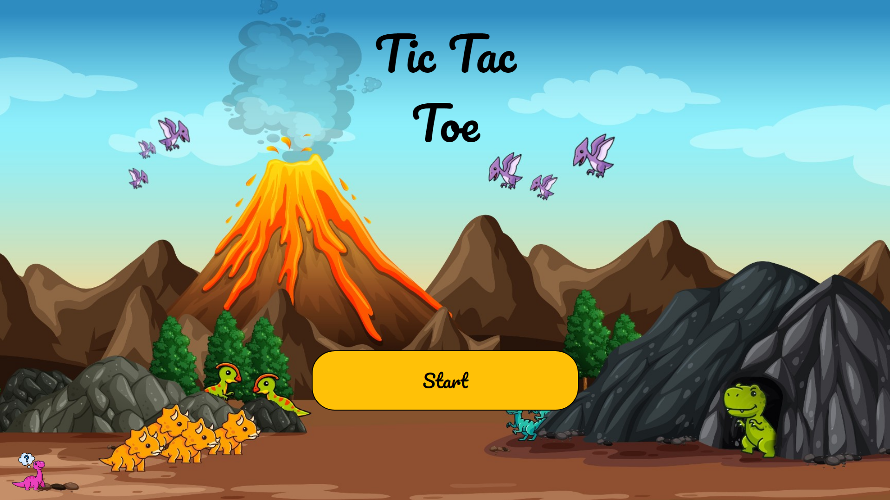 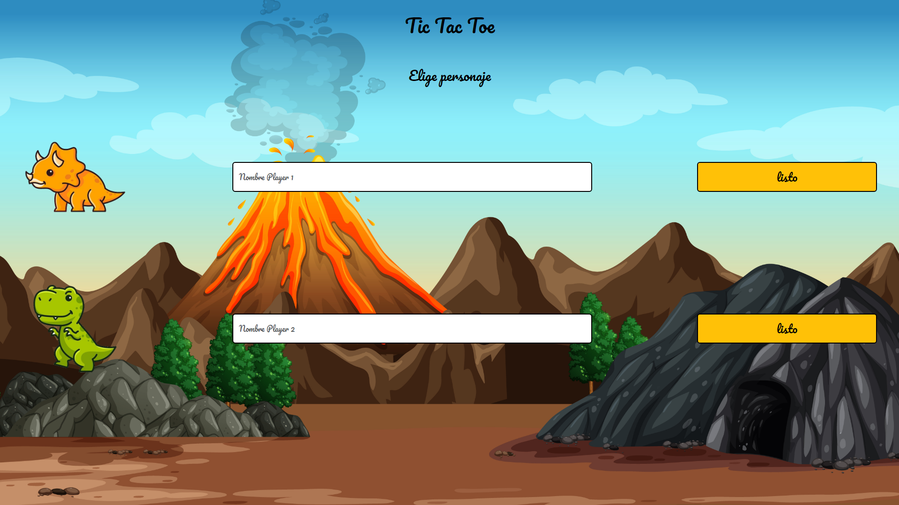 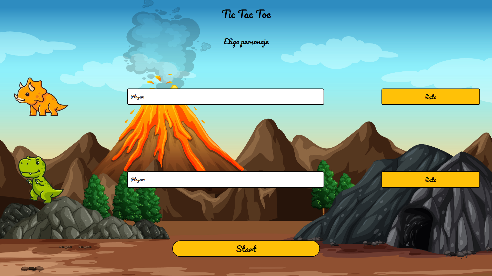 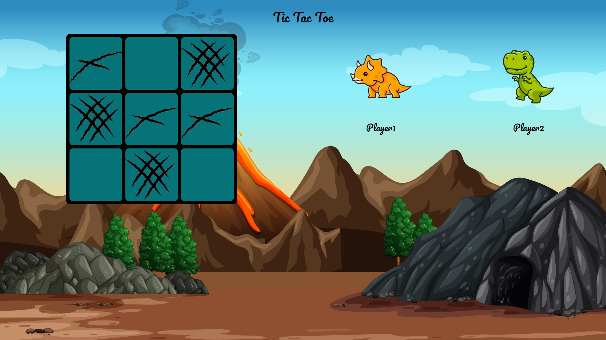 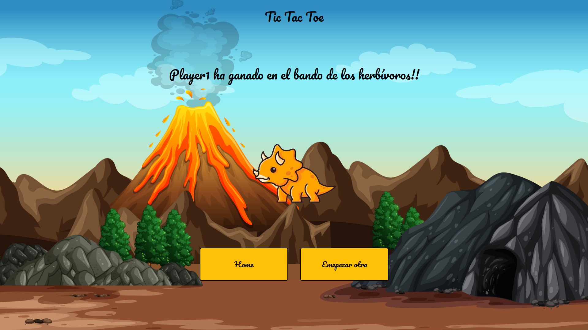 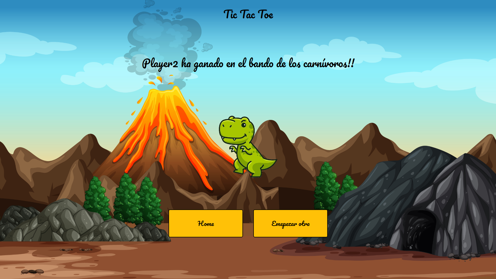 

## Vistas en Nexus 5
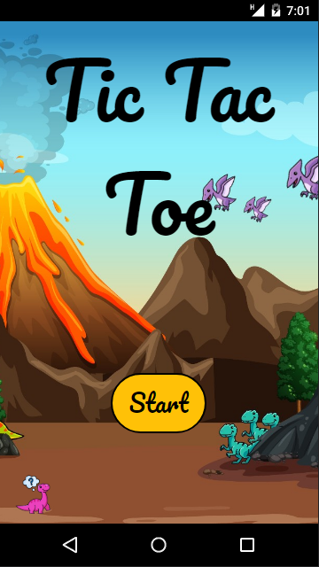 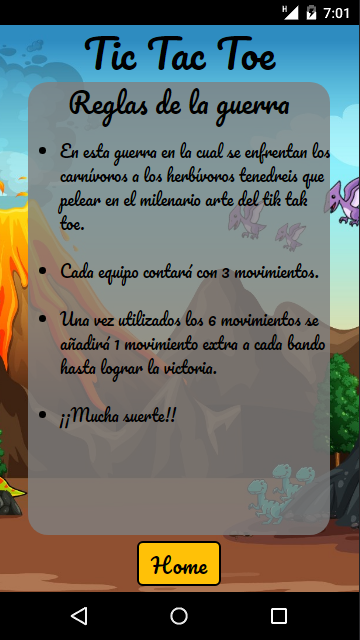 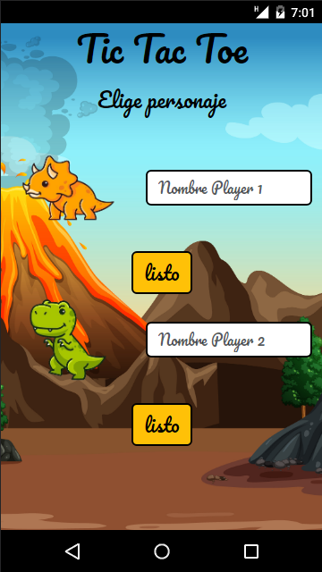 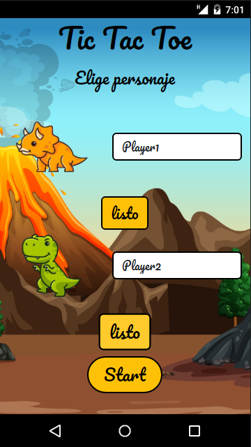 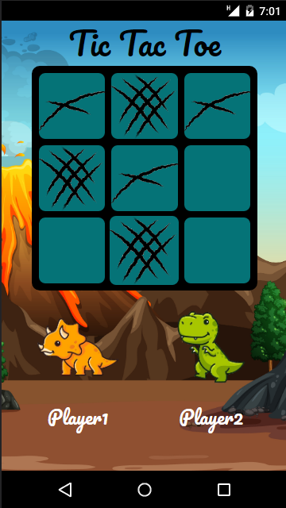 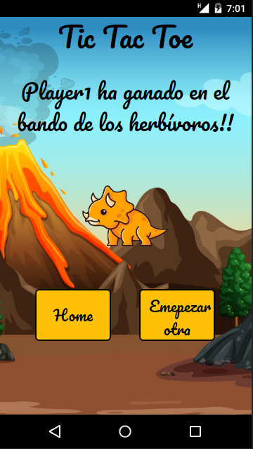 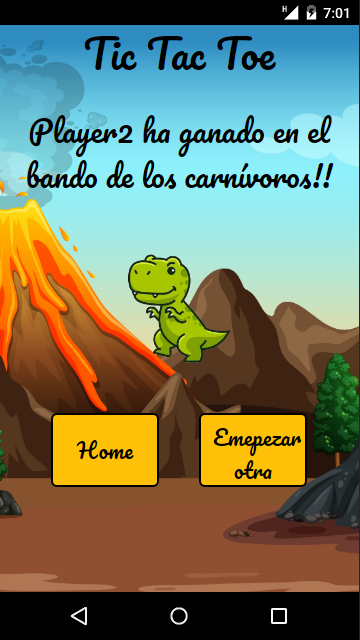 

## Versiones y problemas
Actualmente se encuentra en la Version 1.0, principalmete la mayor dificultad a la hora a afrontar este juego fue: el manejo y la lógica detrás de el, el posicionamiento de imágenes y jugabilidad. 

Se consiguió arreglar la mayoria de los fallos y bugs dentro del juego ya que todavia se encuentra en desarrollo.

## License
Este proyecto ha sido creado bajo una Licencia MIT. Para obtener más información sobre los detalles, vaya a LICENSE.md.

## Agradecimientos:

Quiero agradecer a mis mentores de GeekHub por todo el apoyo que nos han brindado todos los días:
- **Dani**  
 

- **Jose**  
 

- **David**  

- ***Mara***  
 

## Contacto

No dude en ponerse en contacto conmigo en cualquier momento, para ayudarlo con su proyecto con React o para darme su opinión.

 

